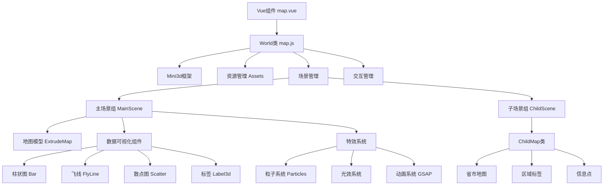
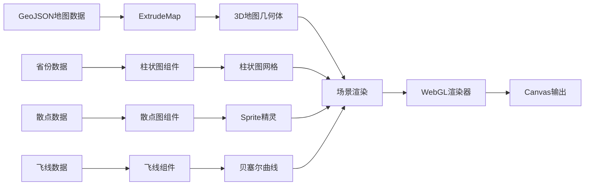

# Map-Animate 3D地图可视化系统技术详细说明文档

## 项目概述

Map-Animate是一个基于Three.js和自研Mini3d框架的高性能3D地图可视化系统，专门用于展示中国地图的多层级数据可视化。该系统实现了从国家级到省市级的地图钻取功能，集成了丰富的数据可视化组件和视觉特效。

### 技术栈
- **核心引擎**: Three.js + 自研Mini3d框架
- **前端框架**: Vue 3 + Composition API
- **动画库**: GSAP (GreenSock Animation Platform)
- **地理投影**: D3-geo (墨卡托投影)
- **交互管理**: three.interactive
- **开发语言**: JavaScript ES6+

### 项目结构
```
map-animate/
├── map.js                    # 核心3D地图可视化引擎 (1452行)
├── map-china-child.js        # 子地图处理类 (444行)  
├── map.vue                   # Vue组件界面 (473行)
├── town-map-renderer.js      # 村镇地图渲染器
├── town-map.vue             # 村镇地图组件
├── town-world.js            # 村镇世界类
└── map/                     # 工具类和数据目录
    ├── assets.js            # 资源管理器 (107行)
    ├── extrudeMap.js        # 地图挤出器 (171行)
    ├── baseMap.js           # 基础地图类
    ├── chinaData.js         # 中国地图数据
    ├── provincesData.js     # 省份数据配置 (294行)
    ├── scatter.js           # 散点图数据
    ├── badgesData.js        # 标牌数据
    ├── pathData.js          # 路径数据
    ├── DiffuseShader.js     # 扩散着色器
    └── Reflector.js         # 反射镜面效果
```

## 系统架构设计

### 1. 整体架构


### 2. 数据流架构


## 核心模块技术详解

### 1. World类 - 核心引擎 (map.js)

#### 1.1 类继承结构
```javascript
export class World extends Mini3d {
  constructor(canvas, config) {
    super(canvas, config)  // 继承Mini3d基础功能
    // 地图特定初始化
  }
}
```

#### 1.2 核心属性和配置
```javascript
// 地理投影配置
this.pointCenter = [108.55, 34.32]        // 中国地图中心点
this.flyLineCenter = [116.41995, 40.18994] // 飞线中心点(北京)
this.depth = 5                            // 地图挤出深度

// 场景配置
this.scene.fog = new Fog(0x011024, 1, 500)     // 雾效果
this.scene.background = new Color(0x011024)     // 深蓝背景

// 相机配置
this.camera.instance.near = 1      // 近裁剪面
this.camera.instance.far = 10000   // 远裁剪面
```

#### 1.3 场景组织架构
```javascript
// 层级化场景管理
this.sceneGroup = new Group()       // 根场景组
this.mainSceneGroup = new Group()   // 主场景组(中国地图)
this.childSceneGroup = new Group()  // 子场景组(省市地图)

// 功能性子组
this.labelGroup = new Group()       // 标签组
this.gqGroup = new Group()          // 光圈组  
this.provinceNameGroup = new Group() // 省份名称组
this.badgeGroup = new Group()       // 标牌组
```

#### 1.4 入场动画时间线系统
```javascript
let tl = gsap.timeline()

// 设置关键时间节点
tl.addLabel("focusMap", 3.5)      // 地图聚焦
tl.addLabel("focusMapOpacity", 4.0) // 透明度变化
tl.addLabel("bar", 5.0)           // 柱状图显示

// 相机动画：俯视 → 斜视
tl.add(gsap.to(this.camera.instance.position, {
  duration: 2.5,
  delay: 2,
  x: 3.134497983573052,
  y: 126.8312346165316,
  z: 78.77649752477839,
  ease: "circ.out"
}))
```

### 2. 地图挤出系统 (extrudeMap.js)

#### 2.1 核心功能
ExtrudeMap类负责将2D GeoJSON数据转换为3D挤出几何体：

```javascript
export class ExtrudeMap {
  constructor({ assets, time, geoProjection }, config) {
    // 地图挤出配置
    this.config = {
      depth: 0.1,                    // 挤出深度
      topFaceMaterial: Material,     // 顶面材质
      sideMaterial: Material,        // 侧面材质
      lineMaterial: LineMaterial,    // 线条材质
    }
  }
}
```

#### 2.2 几何体生成流程
```javascript
// 1. 解析GeoJSON数据
mapData.features.forEach((feature) => {
  // 2. 提取坐标信息
  const { name, center, centroid, adcode } = feature.properties
  
  // 3. 创建Shape轮廓
  const shape = new Shape()
  polygon.forEach((point, i) => {
    const [x, y] = this.geoProjection(point)
    if (i === 0) shape.moveTo(x, -y)
    else shape.lineTo(x, -y)
  })
  
  // 4. 挤出3D几何体
  const extrudeSettings = {
    depth: this.config.depth,
    bevelEnabled: true,
    bevelSegments: 1,
    bevelThickness: 0.1,
  }
  const geometry = new ExtrudeGeometry(shape, extrudeSettings)
  
  // 5. 创建网格对象
  const mesh = new Mesh(geometry, materials)
})
```

#### 2.3 地理投影转换
```javascript
geoProjection = (coordinates) => {
  return geoMercator()
    .center(this.config.center)     // 投影中心
    .scale(120)                     // 缩放级别
    .translate([0, 0])              // 平移偏移
    (coordinates)
}
```

### 3. 子地图系统 (map-china-child.js)

#### 3.1 ChildMap类设计
ChildMap专门处理省市级地图的显示和交互：

```javascript
export class ChildMap {
  constructor(parent, options) {
    this.parent = parent              // 父级地图实例
    this.instance = new Group()      // 子地图根组
    this.instance.rotateX(-Math.PI / 2) // 旋转到水平面
    
    // 子组件管理
    this.areaLabelGroup = new Group()    // 区域标签组
    this.areaPointGroup = new Group()    // 区域点组  
    this.infoLabelGroup = new Group()    // 信息标签组
  }
}
```

#### 3.2 自适应缩放算法
```javascript
calculateScale(parentBoxSize, boxSize) {
  let xScale = parentBoxSize[0] / boxSize[0]
  let yScale = parentBoxSize[1] / boxSize[1]
  return Math.min(xScale, yScale)  // 选择较小缩放保持比例
}

setScale(map) {
  let boundBox = getBoundBox(map.mapGroup)
  let scale = this.calculateScale(parentBoxSize, [boundBox.boxSize.x, boundBox.boxSize.y])
  
  // 应用缩放
  map.mapGroup.scale.set(scale, scale, 1)
  
  // 居中定位
  map.mapGroup.position.x = -boundBox.center.x
  map.mapGroup.position.y = -boundBox.center.y
}
```

#### 3.3 多层级导航历史管理
```javascript
// 历史记录系统
this.history = new createHistory()
this.history.push({ name: "中国" })  // 初始状态

// 点击省份进入子地图
mesh.addEventListener("mousedown", (event) => {
  let userData = event.target.parent.userData
  this.history.push(userData)        // 记录当前层级
  this.loadChildMap(userData)        // 加载子地图
})

// 返回上一级
goBack() {
  this.history.undo()                // 撤销历史
  if (!this.history.getIndex()) {
    // 返回主地图
    this.setMainMapVisible(true)
  } else {
    // 返回上级子地图
    let userData = this.history.present
    this.loadChildMap(userData)
  }
}
```

### 4. 数据可视化组件系统

#### 4.1 柱状图系统 (createBar)
基于数据值生成3D柱状图：

```javascript
createBar() {
  let data = sortByValue(provincesData)  // 按值排序
  const factor = 7
  const height = 4.0 * factor
  const max = data[0].value            // 最大值归一化
  
  data.map((item, index) => {
    // 计算柱子高度
    let geoHeight = height * (item.value / max)
    
    // 渐变材质配置
    let material = new MeshBasicMaterial({
      color: 0xffffff,
      transparent: true,
      opacity: 0,
    })
    
    // 应用渐变着色器
    new GradientShader(material, {
      uColor1: index < 3 ? 0xfbdf88 : 0x50bbfe,  // 前3名金色，其他蓝色
      uColor2: index < 3 ? 0xfbdf88 : 0x50bbfe,
      size: geoHeight,
      dir: "y",  // Y轴方向渐变
    })
    
    // 创建立方体几何体
    const geo = new BoxGeometry(0.05 * factor, 0.05 * factor, geoHeight)
    geo.translate(0, 0, geoHeight / 2)  // 底部对齐
    
    // 定位到省份中心
    let [x, y] = this.geoProjection(item.centroid)
    areaBar.position.set(x, -y, this.depth + 0.46)
  })
}
```

#### 4.2 飞线系统 (createFlyLine)
基于贝塞尔曲线的动态飞线效果：

```javascript
createFlyLine() {
  // 纹理配置
  const texture = this.assets.instance.getResource("flyLine")
  texture.wrapS = texture.wrapT = RepeatWrapping
  texture.repeat.set(0.5, 1)
  
  // 飞线组件
  let flyLine = new FlyLine(this, {
    centerPoint: this.flyLineCenter,  // 中心点(北京)
    data: provincesData,             // 目标点数据
    texture: texture,
    material: new MeshBasicMaterial({
      map: texture,
      alphaMap: texture,
      color: 0xfbdf88,
      transparent: true,
      blending: AdditiveBlending,    // 加法混合发光效果
    }),
  })
}
```

#### 4.3 散点图系统 (createScatter)
基于Sprite的自适应散点图：

```javascript
createScatter() {
  let scatterAllData = sortByValue(scatterData)
  let max = scatterAllData[0].value
  
  scatterAllData.map((data) => {
    const sprite = new Sprite(material)
    
    // 根据数值自适应缩放
    let scale = 2 + (data.value / max) * 1
    sprite.scale.set(scale, scale, scale)
    
    // 地理坐标定位
    let [x, y] = this.geoProjection([data.lng, data.lat])
    sprite.position.set(x, -y, this.depth + 0.41)
  })
}
```

#### 4.4 3D标签系统 (Label3d)
基于CSS3DRenderer的HTML标签渲染：

```javascript
// 人口数量标签
function labelStyle04(data, index, position) {
  let label = self.label3d.create("", "provinces-label-style02", true)
  label.init(
    `<div class="provinces-label-style02 ${index < 3 ? "yellow" : ""}">
      <div class="provinces-label-style02-wrap">
        <div class="number">
          <span class="value">${data.value}</span>
          <span class="unit">万人</span>
        </div>
        <div class="no">${index + 1}</div>
      </div>
    </div>`,
    position
  )
  
  // 设置标签样式和缩放
  self.label3d.setLabelStyle(label, 0.05, "x")
  return label
}
```

### 5. 视觉特效系统

#### 5.1 光效系统
包含多种光源和光效组件：

```javascript
// 环境光 - 基础照明
let sun = new AmbientLight(0xffffff, 2)

// 方向光 - 主光源和阴影
let directionalLight = new DirectionalLight(0xffffff, 4)
directionalLight.position.set(-30, 6, -8)
directionalLight.castShadow = true

// 点光源 - 科技感蓝光
this.createPointLight({
  color: "#0e81fb",
  intensity: 160,
  distance: 10000,
  x: -3, y: 16, z: -3,
})
```

#### 5.2 辉光特效 (createHUIGUANG)
基于加法混合的3重辉光效果：

```javascript
createHUIGUANG(h, color) {
  let geometry = new PlaneGeometry(1.5, h)
  let material = new MeshBasicMaterial({
    color: color,
    map: texture,
    transparent: true,
    opacity: 0.4,
    side: DoubleSide,
    blending: AdditiveBlending,  // 加法混合
  })
  
  let mesh = new Mesh(geometry, material)
  let mesh2 = mesh.clone()
  let mesh3 = mesh.clone()
  
  // 3个平面120度旋转形成辉光
  mesh2.rotateY((Math.PI / 180) * 60)
  mesh3.rotateY((Math.PI / 180) * 120)
  
  return [mesh, mesh2, mesh3]
}
```

#### 5.3 光圈动画 (createQuan)
双层光圈旋转动画：

```javascript
createQuan() {
  // 双层光圈材质
  let material1 = new MeshBasicMaterial({
    map: guangquan1,
    alphaMap: guangquan1,
    blending: AdditiveBlending,
  })
  
  let mesh1 = new Mesh(geometry, material1)
  let mesh2 = new Mesh(geometry, material2)
  
  // 旋转动画
  this.time.on("tick", (delta) => {
    mesh1.rotation.z += delta * 2
  })
  
  return new Group().add(mesh1, mesh2)
}
```

#### 5.4 网格扩散特效 (createGridRipple)
基于DiffuseShader的网格扩散动画：

```javascript
createGridRipple() {
  // 网格纹理配置
  texture.repeat.set(40, 40)
  
  let material = new MeshBasicMaterial({
    map: texture,
    color: 0x00ffff,
    alphaMap: alphaMap,
    blending: AdditiveBlending,
  })
  
  // 应用扩散着色器
  new DiffuseShader({
    material,
    time: this.time,
    size: 300,
    diffuseColor: 0x079fe6,
    diffuseSpeed: 30,
    diffuseWidth: 20,
    diffuseDir: 2.0,
  })
}
```

#### 5.5 镜面反射系统 (createMirror)
基于Reflector的实时镜面反射：

```javascript
createMirror() {
  const groundMirror = new Reflector(geometry, {
    clipBias: 0.003,
    textureWidth: this.sizes.width,
    textureHeight: this.sizes.height,
    color: 0xb5b5b5,
    multisample: 1,
  })
  
  groundMirror.material.transparent = true
  groundMirror.material.opacity = 0.2
  groundMirror.rotateX(-Math.PI / 2)
}
```

#### 5.6 粒子系统 (createParticles)
基于Mini3d粒子组件的环境粒子：

```javascript
createParticles() {
  this.particles = new Particles(this, {
    num: 10,          // 粒子数量
    range: 200,       // 分布范围
    dir: "up",        // 运动方向
    speed: 0.1,       // 运动速度
    material: new PointsMaterial({
      map: Particles.createTexture(),
      size: 10,
      color: 0x00eeee,
      blending: AdditiveBlending,
      sizeAttenuation: true,
    }),
  })
}
```

### 6. 交互管理系统

#### 6.1 交互管理器配置
```javascript
// 初始化交互管理器
this.interactionManager = new InteractionManager(
  this.renderer.instance,
  this.camera.instance, 
  this.canvas
)

// 添加可交互元素
this.eventElement.map((mesh) => {
  this.interactionManager.add(mesh)
})
```

#### 6.2 鼠标事件处理
```javascript
// 悬停效果
mesh.addEventListener("mouseover", (event) => {
  document.body.style.cursor = "pointer"
  
  // 地图区域突出显示
  gsap.to(mesh.scale, { duration: 0.3, z: 1.5 })
  
  // 相关组件联动上升
  this.setBarMove(mesh.userData.adcode, "up")
  this.setGQMove(mesh.userData.adcode, "up")
  this.setLabelMove(mesh.userData.adcode, "up")
  this.setScatterMove(mesh.userData.adcode, "up")
})

// 点击切换子地图
mesh.addEventListener("mousedown", (event) => {
  if (this.clicked) return false
  this.clicked = true
  
  let userData = event.target.parent.userData
  this.history.push(userData)  // 记录历史
  this.loadChildMap(userData)  // 加载子地图
})
```

#### 6.3 组件联动动画
```javascript
// 柱状图联动上升
setBarMove(adcode, type = "up") {
  this.allBar.map((barGroup) => {
    if (barGroup.userData.adcode === adcode) {
      gsap.to(barGroup.position, {
        duration: 0.3,
        z: type === "up" ? 
          barGroup.userData.position[2] + this.depth / 2 + 0.3 : 
          barGroup.userData.position[2],
      })
    }
  })
}
```

### 7. 资源管理系统 (assets.js)

#### 7.1 资源管理器架构
```javascript
export class Assets {
  constructor(onLoadCallback = null) {
    this.instance = new Resource()  // 使用Mini3d资源管理器
    this.instance.addLoader(FileLoader, "FileLoader")  // 添加文件加载器
  }
}
```

#### 7.2 资源配置清单
```javascript
let assets = [
  // 纹理贴图资源
  { type: "Texture", name: "grid", path: grid },
  { type: "Texture", name: "flyLine", path: flyLine },
  { type: "Texture", name: "guangquan1", path: guangquan1 },
  { type: "Texture", name: "side", path: side },
  { type: "Texture", name: "topNormal", path: topNormal },
  
  // JSON数据文件
  { type: "File", name: "china", path: base_url + "assets/json/中华人民共和国.json" },
  { type: "File", name: "chinaStorke", path: base_url + "assets/json/中华人民共和国-轮廓.json" },
  { type: "File", name: "transportPath", path: base_url + "assets/json/运输路径.json" },
]
```

#### 7.3 加载进度管理
```javascript
// 监听加载进度
this.instance.on("onProgress", (path, itemsLoaded, itemsTotal) => {
  let progress = (itemsLoaded / itemsTotal) * 100
  let bfb = progress.toFixed(2) + "%"
})

// 监听加载完成
this.instance.on("onLoad", () => {
  this.onLoadCallback && this.onLoadCallback()
})
```

### 8. Vue组件设计 (map.vue)

#### 8.1 组件结构
```vue
<template>
  <div class="map-level">
    <!-- 3D地图画布 -->
    <canvas id="canvas"></canvas>
    
    <!-- 返回按钮 -->
    <div class="return-btn" @click="goBack">返回上一级</div>
    
    <!-- 导航按钮 -->
    <div class="nav-to-town">
      <router-link to="/town-map" class="town-nav-btn">
        🏘️ 村镇级地图
      </router-link>
    </div>
    
    <!-- 效果控制按钮组(已注释) -->
    <!-- <div class="map-btn-group">...</div> -->
  </div>
</template>
```

#### 8.2 状态管理
```javascript
// 地图特效状态
const state = reactive({
  bar: true,       // 柱状图
  flyLine: false,  // 飞线效果
  scatter: false,  // 散点图
  card: false,     // 标牌
  particle: false, // 粒子特效
  mirror: false,   // 倒影效果
  path: false,     // 路径轨迹
})
```

#### 8.3 特效控制函数
```javascript
const setEffectToggle = (type) => {
  // 子场景中禁用某些特效
  if (["bar", "flyLine", "scatter", "card", "path"].includes(type) && 
      app?.currentScene === "childScene") {
    return false
  }
  
  state[type] = !state[type]
  
  // 根据类型控制相应特效
  switch(type) {
    case "bar":
      app.barGroup.visible = state[type]
      app.setLabelVisible("labelGroup", state[type])
      break
    case "flyLine":
      app.flyLineGroup.visible = state[type]
      app.flyLineFocusGroup.visible = state[type]
      break
    // ... 其他特效控制
  }
}
```

#### 8.4 生命周期管理
```javascript
// 组件挂载
onMounted(() => {
  app = new World(document.getElementById("canvas"), {
    geoProjectionCenter: [108.55, 34.32],
    setEnable: setEnable,
  })
})

// 组件卸载
onBeforeUnmount(() => {
  app && app.destroy()
})
```

## 数据结构设计

### 1. 省份数据结构 (provincesData.js)
```javascript
{
  name: "北京市",                      // 省市名称
  center: [116.405285, 39.904989],   // 地理中心坐标 [经度, 纬度]
  centroid: [116.41995, 40.18994],   // 几何中心坐标 [经度, 纬度]
  adcode: 110000,                    // 行政区代码(国家标准)
  enName: "",                        // 英文名称(预留)
  value: 50,                         // 数值(用于柱状图高度)
}
```

### 2. 散点图数据结构
```javascript
{
  name: "城市名称",
  lng: 116.405285,     // 经度
  lat: 39.904989,      // 纬度
  adcode: 110000,      // 行政区代码
  value: 100,          // 数值(用于大小缩放)
}
```

### 3. GeoJSON地图数据结构
```javascript
{
  type: "FeatureCollection",
  features: [{
    type: "Feature",
    properties: {
      name: "省份名称",
      center: [lng, lat],      // 中心点
      centroid: [lng, lat],    // 质心
      adcode: 110000,          // 行政区代码
      childrenNum: 16,         // 子区域数量
    },
    geometry: {
      type: "MultiPolygon",
      coordinates: [...]       // 几何坐标数据
    }
  }]
}
```

## 性能优化策略

### 1. 几何体优化
- **BufferGeometry**: 使用BufferGeometry替代Geometry提升性能
- **实例化渲染**: 对重复几何体使用InstancedMesh
- **几何体合并**: 将多个静态几何体合并减少Draw Call
- **LOD系统**: 根据距离调整几何体细节级别

### 2. 材质和纹理优化
- **纹理压缩**: 使用适当的纹理格式和尺寸
- **材质共享**: 多个对象共享相同材质实例
- **纹理图集**: 将小纹理合并到图集中
- **Mipmapping**: 启用纹理Mipmap提升远距离渲染性能

### 3. 渲染优化
- **视锥体剔除**: 自动剔除视野外的对象
- **渲染顺序**: 合理设置renderOrder减少状态切换
- **透明度排序**: 正确处理透明对象的渲染顺序
- **深度测试**: 合理配置depthTest和depthWrite

### 4. 内存管理
- **资源释放**: 及时释放不需要的几何体、材质、纹理
- **事件清理**: 销毁时移除所有事件监听器
- **DOM清理**: 清理CSS3D标签对应的DOM元素
- **WebGL上下文**: 避免WebGL上下文丢失

### 5. 动画优化
- **requestAnimationFrame**: 使用RAF同步动画帧率
- **动画池**: 复用动画对象避免频繁创建
- **缓动函数**: 使用硬件加速的CSS缓动
- **批量更新**: 批量处理属性更新减少重绘

## 设计模式应用

### 1. 观察者模式 (EventEmitter)
```javascript
// Mini3d框架中的事件系统
class EventEmitter {
  on(eventName, callback) { /* ... */ }
  emit(eventName, ...args) { /* ... */ }
  off(eventName, callback) { /* ... */ }
}

// 使用示例
this.time.on("tick", (delta) => {
  // 动画更新逻辑
})
```

### 2. 工厂模式 (组件创建)
```javascript
// 标签工厂函数
function labelStyle04(data, index, position) {
  let label = self.label3d.create("", "provinces-label-style02", true)
  label.init(template, position)
  return label
}

// 特效工厂函数
createHUIGUANG(h, color) {
  // 返回配置好的辉光效果数组
  return [mesh1, mesh2, mesh3]
}
```

### 3. 策略模式 (材质配置)
```javascript
// 不同层级使用不同材质策略
createProvinceMaterial() {
  let topMaterial = new MeshStandardMaterial({ /* 顶面配置 */ })
  let sideMaterial = new MeshStandardMaterial({ /* 侧面配置 */ })
  
  // 自定义着色器策略
  sideMaterial.onBeforeCompile = (shader) => {
    // 修改着色器代码
  }
  
  return [topMaterial, sideMaterial]
}
```

### 4. 命令模式 (历史记录)
```javascript
// 历史记录系统
this.history = new createHistory()
this.history.push(userData)  // 执行命令
this.history.undo()          // 撤销命令
this.history.redo()          // 重做命令
```

### 5. 组合模式 (场景树)
```javascript
// 场景层级组合
this.sceneGroup.add(this.mainSceneGroup, this.childSceneGroup)
this.mainSceneGroup.add(this.labelGroup, this.gqGroup, this.provinceNameGroup)

// 批量操作
group.traverse((child) => {
  if (child.isMesh) {
    // 对所有网格执行操作
  }
})
```

### 6. 单例模式 (资源管理)
```javascript
// 资源管理器单例
export class Assets {
  constructor(onLoadCallback = null) {
    if (Assets.instance) {
      return Assets.instance
    }
    Assets.instance = this
    // 初始化逻辑
  }
}
```

## 扩展性设计

### 1. 模块化架构
- **插件系统**: 支持动态加载功能插件
- **组件化**: 独立的可视化组件可复用
- **配置驱动**: 通过配置文件控制功能开关
- **API设计**: 提供清晰的对外接口

### 2. 数据适配层
- **数据转换器**: 支持多种数据格式输入
- **投影系统**: 支持多种地理投影方式
- **坐标转换**: 自动处理坐标系转换
- **数据校验**: 输入数据格式验证

### 3. 渲染管线
- **着色器系统**: 可插拔的着色器效果
- **后处理**: 支持后处理效果管线
- **多渲染器**: 支持WebGL1/2/WebGPU
- **平台适配**: 移动端和桌面端优化

### 4. 交互扩展
- **手势支持**: 触摸和多点触控
- **键盘快捷键**: 自定义快捷键绑定
- **VR/AR**: 虚拟现实和增强现实支持
- **多设备**: 多屏幕和多设备协同

## 技术优势与特色

### 1. 高性能3D渲染
- **硬件加速**: 充分利用GPU渲染能力
- **优化算法**: 视锥体剔除、LOD、实例化等
- **内存效率**: 智能的资源管理和垃圾回收
- **流畅动画**: 60FPS的流畅动画体验

### 2. 丰富的视觉效果
- **专业光效**: 辉光、光圈、扩散等特效
- **粒子系统**: GPU加速的粒子特效
- **材质系统**: PBR材质和自定义着色器
- **后处理**: Bloom、SSAO等后处理效果

### 3. 完善的交互体验
- **多层级导航**: 国家→省→市的无缝切换
- **智能联动**: 鼠标悬停时相关组件联动
- **历史记录**: 支持前进后退导航
- **响应式设计**: 适应不同屏幕尺寸

### 4. 数据可视化能力
- **多种图表**: 柱状图、散点图、飞线图
- **实时更新**: 支持数据动态更新
- **自适应缩放**: 根据数据范围自动缩放
- **颜色映射**: 数据值到颜色的智能映射

### 5. 工程化程度高
- **模块化设计**: 清晰的模块边界和职责
- **配置驱动**: 灵活的配置系统
- **错误处理**: 完善的错误处理和降级策略
- **文档完整**: 详细的代码注释和文档

## 应用场景与价值

### 1. 政府和公共服务
- **智慧城市**: 城市数据可视化监控
- **应急指挥**: 突发事件态势展示
- **统计展示**: 人口、经济等统计数据
- **规划决策**: 城市规划和政策制定支持

### 2. 商业和企业
- **市场分析**: 销售数据地理分布
- **物流监控**: 运输路径和仓储分布
- **分支机构**: 企业网点和业务覆盖
- **风险控制**: 地理风险评估和预警

### 3. 科研和教育
- **地理教学**: 交互式地理知识展示
- **数据研究**: 地理空间数据分析
- **环境监测**: 环境数据可视化
- **学术展示**: 研究成果可视化展示

### 4. 媒体和展示
- **新闻报道**: 新闻事件地理信息展示
- **展览展示**: 博物馆和展厅应用
- **营销推广**: 产品和服务地理覆盖
- **品牌宣传**: 企业实力和影响力展示

## 技术发展趋势

### 1. 渲染技术进化
- **WebGPU**: 下一代Web图形API
- **实时光线追踪**: 更真实的光照效果
- **AI渲染**: 机器学习辅助的渲染优化
- **云渲染**: 云端GPU渲染服务

### 2. 交互技术升级
- **手势识别**: 自然的手势交互
- **语音控制**: 语音指令操作
- **眼动追踪**: 视线跟踪交互
- **脑机接口**: 意念控制技术

### 3. 数据处理能力
- **大数据可视化**: 海量数据实时渲染
- **流式数据**: 实时数据流处理
- **分布式渲染**: 多节点协同渲染
- **边缘计算**: 边缘设备上的计算加速

### 4. 平台融合趋势
- **跨平台统一**: Web、移动、桌面统一
- **VR/AR集成**: 沉浸式体验
- **IoT整合**: 物联网数据集成
- **5G应用**: 低延迟实时交互

## 总结

Map-Animate 3D地图可视化系统是一个技术先进、功能完善的企业级可视化解决方案。系统基于现代Web技术栈，采用模块化架构设计，实现了高性能的3D地图渲染、丰富的数据可视化效果、流畅的交互体验和完善的功能扩展性。

### 核心技术价值：
1. **自研框架集成**: 基于Mini3d框架的深度定制
2. **高性能渲染**: WebGL硬件加速的流畅体验
3. **模块化设计**: 清晰的架构和良好的可维护性
4. **丰富特效**: 专业级的视觉效果和动画
5. **完善交互**: 多层级导航和智能联动

### 工程实践意义：
- 为Three.js企业级应用提供了完整的解决方案
- 展示了现代Web 3D技术的最佳实践
- 提供了可复用的可视化组件和设计模式
- 为地理信息可视化设立了技术标杆

该系统不仅具有很高的实用价值，也为Web 3D技术的发展和应用提供了重要的参考价值，是学习和研究现代Web可视化技术的优秀案例。 